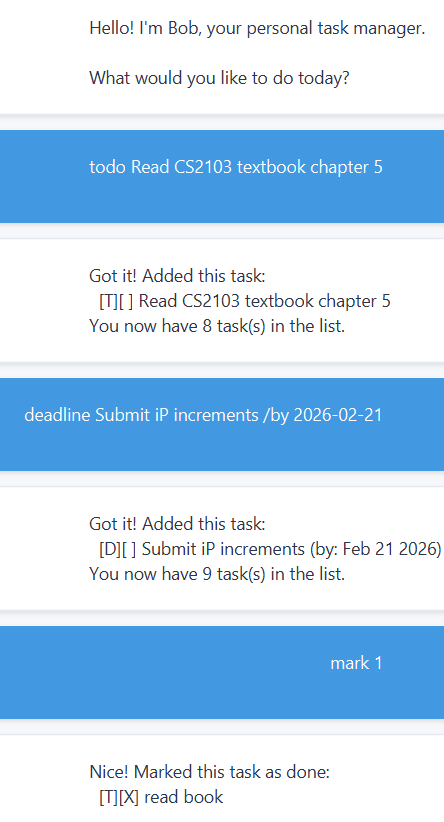

# Bob User Guide



Bob is a **friendly task management application** that helps you keep track of your todos, deadlines, and events through a clean graphical interface. Bob is designed to be simple, intuitive, and efficient for managing your daily tasks.

## Quick Start

1. Ensure you have Java 17 or above installed.
2. Download the latest `ip.jar` from the releases page.
3. Double-click the jar file to start the application.
4. Type commands in the text box and press Enter to execute them.
5. Refer to the Features below for details of each command.

## Features

### Adding a Todo: `todo`

Adds a simple task without any date.

Format: `todo DESCRIPTION`

Example:
- `todo Buy groceries`
- `todo Read book`

Expected output:
```
Got it. I've added this task:
  [T][ ] Buy groceries
Now you have 1 task(s) in the list.
```

### Adding a Deadline: `deadline`

Adds a task with a specific due date.

Format: `deadline DESCRIPTION /by YYYY-MM-DD`

Example:
- `deadline Submit assignment /by 2026-03-01`
- `deadline Pay bills /by 2026-02-28`

Expected output:
```
Got it. I've added this task:
  [D][ ] Submit assignment (by: Mar 1 2026)
Now you have 2 task(s) in the list.
```

### Adding an Event: `event`

Adds an event with a start and end date.

Format: `event DESCRIPTION /from YYYY-MM-DD /to YYYY-MM-DD`

Example:
- `event Conference /from 2026-03-10 /to 2026-03-12`
- `event Team meeting /from 2026-02-20 /to 2026-02-20`

Expected output:
```
Got it. I've added this task:
  [E][ ] Conference (from: Mar 10 2026 to: Mar 12 2026)
Now you have 3 task(s) in the list.
```

### Listing All Tasks: `list`

Shows all tasks in your task list.

Format: `list`

Expected output:
```
Here are the tasks in your list:
1. [T][ ] Buy groceries
2. [D][ ] Submit assignment (by: Mar 1 2026)
3. [E][ ] Conference (from: Mar 10 2026 to: Mar 12 2026)
```

### Marking a Task as Done: `mark`

Marks a task as completed.

Format: `mark INDEX`

Example:
- `mark 1`

Expected output:
```
Nice! I've marked this task as done:
  [T][X] Buy groceries
```

### Unmarking a Task: `unmark`

Marks a completed task as not done.

Format: `unmark INDEX`

Example:
- `unmark 1`

Expected output:
```
OK, I've marked this task as not done yet:
  [T][ ] Buy groceries
```

### Deleting a Task: `delete`

Removes a task from your list.

Format: `delete INDEX`

Example:
- `delete 2`

Expected output:
```
Noted. I've removed this task:
  [D][ ] Submit assignment (by: Mar 1 2026)
Now you have 2 task(s) in the list.
```

### Finding Tasks: `find`

Searches for tasks containing a specific keyword.

Format: `find KEYWORD`

Example:
- `find book`
- `find meeting`

Expected output:
```
Here are the matching tasks in your list:
1. [T][ ] Read book
```

### Sorting Tasks: `sort`

Sorts all tasks alphabetically by description.

Format: `sort`

Expected output:
```
Done! Your tasks are now sorted alphabetically.
```

### Exiting the Program: `bye`

Closes the application.

Format: `bye`

Expected output:
```
Goodbye! Hope to see you again soon!
```

## Command Summary

| Command | Format | Example |
|---------|--------|---------|
| Todo | `todo DESCRIPTION` | `todo Buy milk` |
| Deadline | `deadline DESCRIPTION /by YYYY-MM-DD` | `deadline Submit report /by 2026-03-01` |
| Event | `event DESCRIPTION /from YYYY-MM-DD /to YYYY-MM-DD` | `event Conference /from 2026-03-10 /to 2026-03-12` |
| List | `list` | `list` |
| Mark | `mark INDEX` | `mark 1` |
| Unmark | `unmark INDEX` | `unmark 1` |
| Delete | `delete INDEX` | `delete 2` |
| Find | `find KEYWORD` | `find book` |
| Sort | `sort` | `sort` |
| Exit | `bye` | `bye` |

## Notes

- All dates must be in `YYYY-MM-DD` format (e.g., 2026-02-15)
- Task indices are 1-based (first task is 1, not 0)
- Your tasks are automatically saved and will be loaded when you restart Bob